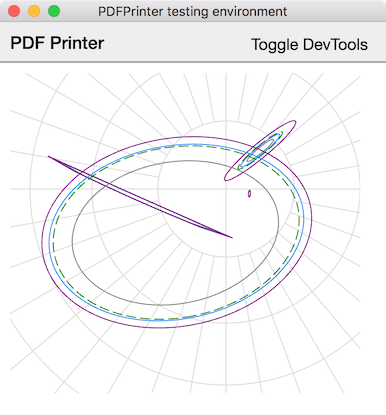

# Figment

**Figment** is a development environment for complex static graphics,
enabling use of the Javascript web visualization pipeline to quickly
and reproducibly generate static graphics. The code-bundling and PDF-generation
features are designed for smooth creation of data-rich scientific figures
using Webkit's powerful DOM and SVG-generation ability.
Ultimately, make building complex figures in Javascript


Although visualization-creation code runs in the browser environment, it is
executed *on your local system*, with the full power of [NodeJS](https://nodejs.org)
APIs directly available. Thus, visualizations can be built from local resources
such as modeling pipelines, database connections, and file resources that are not
exposed via an HTTP API for typical browser use.

This package combines the static-PDF generation capabilities
of  rendering engines such as
[electron-pdf](https://github.com/fraserxu/electron-pdf),
the code-generation capabilities of Javascript bundlers such as
[Parcel](https://parceljs.org) and
[Webpack](https://webpack.js.org),  Since the entire stack
runs on [Electron](https://electronjs.org), it can be


but works at a higher level, and strives purpose.
It is designed to make the
DOM, its SVG extensions, and the universe of awesome
tools that have been designed for it (e.g. `d3`),
a first-class graphics environment for creating high
quality static figures.

## Workflow



- Make a figure!
  - Use HTML/Javascript/SVG/CSS (and preprocessors if needed)
  - Call system APIs, run SQL locally, etc.
- Debug or fiddle with your creation in debug mode
  (pictured above).
  - `pdf-printer --debug empty-file.js`
  - This could be a good opportunity to
    add annotations with [d3-annotation](https://github.com/susielu/d3-annotation).
- Print programmatically from the command line!

## CLI usage

A simple UNIXy CLI is available by default:

```
> pdf-printer [opts] [--] <script> <out.pdf>
```

The `<script>` argument is a Javascript (or coffeescript)
file that exports a function
that takes arguments `el` and `callback`, e.g.

```js
import d3 from "d3"

export function createFigure(el, cb){
  d3.select(el)
    .append("div")
    .text("Significant results detected");
  cb();
}
```

### Options

`--debug`: Show a debug mode in which files are reloaded
on change from the root directory. This can be used to
make changes to figure code and settings in advance of printing.

`--show`: Show figures before printing (wait for user input
before proceeding.

`--reload <dir>`: Set a directory to reload from (for testing)

`--spec-mode`: Reload from a specification file (using the
API below) instead of file parameters at the CLI. The
calling signature then becomes `pdf-printer --spec-mode -- <specfile>`.

## Compile-time helpers

Compile-time helpers can be specified to load, e.g., css
or stylesheets to be passed through preprocessors. Direct
loading with require hooks is emphasized to make things
easier.

Several hooks come prepackaged, but you can add your own
by passing a function to the list of `helpers` options.

### Prepackaged hooks

Hooks for `stylus-css-modules` (both global- and local-by-default)
are included as is a helper for bare `stylus` and `css`.

## API

```coffeescript
p = Printer
  helpers: [
    'stylus-css-modules-global' # The current default
    require 'handlebars-require-hook' # a random function
  ]

p.task 'test.pdf', './test-figure'
p.task 'test2.pdf', (el,callback)->
  d3.select el
    .append 'text'
    .text 'This is a basic figure'
  callback()
```

## Development

- `/main` directory contains main process Javascript
- `/src` directory contains renderer process Javascript/Coffeescript
  (compiled with Parcel).

Compilation can be run with `npm start`.

## TODO

- [ ] Support non-Javascript **Parcel** entrypoints
- [-] Support more formats. *png and jpeg support are half-baked but important*
- Create a dependency on `electron-pdf`?
- Make helpers definable in CLI
- Remove `coffeescript` and `stylus` defaults
- Allow testing on multiple figures at once
