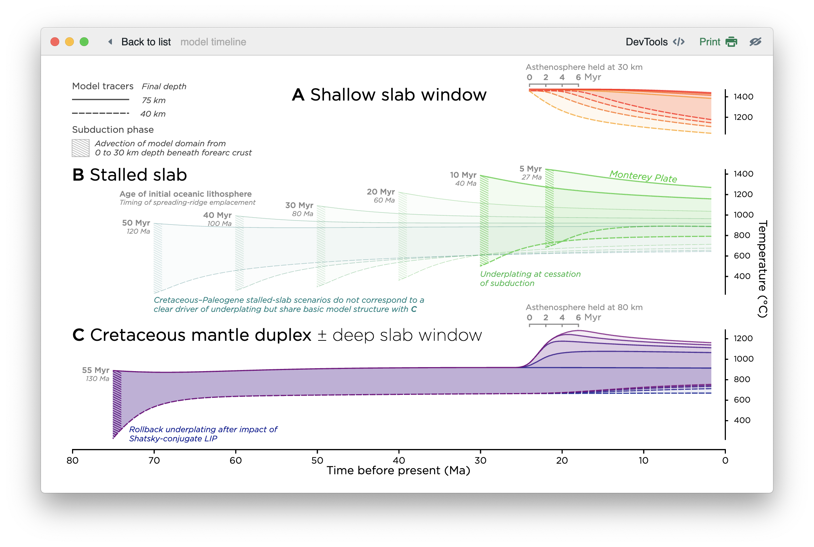
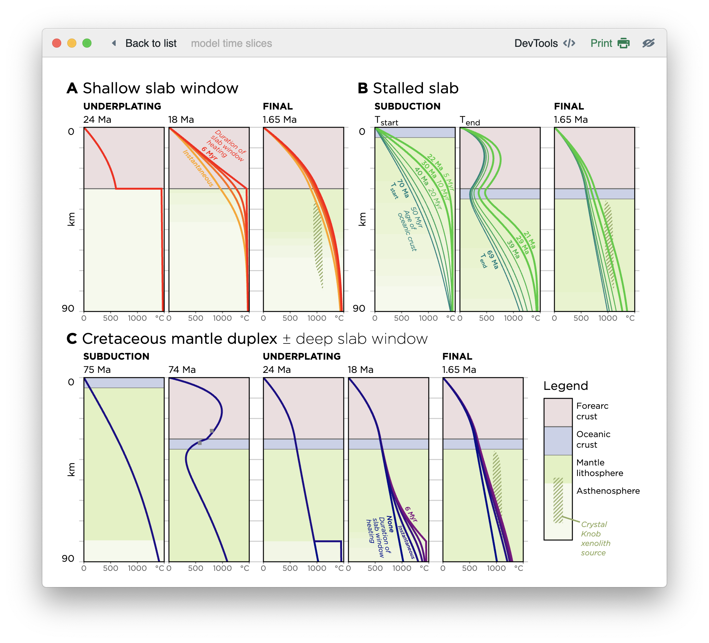
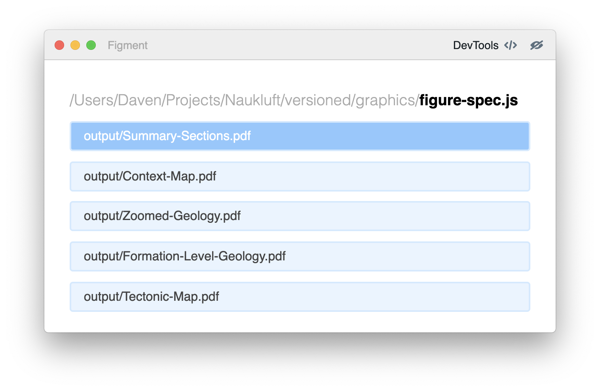

# Figment UI

<p><a href="https://www.npmjs.com/package/figment-ui">

</a></p>

**Figment** renders static figures and graphics to PDF
using Javascript and the web
visualization pipeline.
It bundles code and renders the output, supporting iterative and reproducible
graphics production.
It has been used along with [D3](https://d3js.org) to make beautiful and
data-dense scientific figures, harnessing cutting-edge web tooling without
the complexity of a full web application.

**Figment** seamlessly bundles Javascript,
runs the code to generate a SVG or HTML document,
and renders the output to a PDF. It combines the code-generation and
iterative development capabilities of the
[Parcel](https://parceljs.org) Javascript bundler
with the WebKit renderer and NodeJS runtime
of [Electron](https://electronjs.org).
With **Figment**, graphics can be produced using any browser-based tools;
however, special functionality is included for graphics packaged
as [React](https://reactjs.org) components.

**Installation and usage:** `npm install --global figment-ui` installs
the `figment` executable. Running `figment <entry.js> <output.pdf>` creates
a UI for figure development and user-controlled rendering to PDF.

## Examples


*Model tracers for the western North American mantle lithosphere: results of finite-element modeling in [FiPy](https://www.ctcms.nist.gov/fipy/), cached in PostgreSQL,
and rendered using [D3](https://d3js.org) and **Figment** — [Quinn et al., 2018](https://dx.doi.org/10.1029/2017GC007260), Figure 20.*


*Time slices for the same mantle lithosphere model, rendered in HTML and SVG using **Figment**. This would have been time-consuming to produce in Adobe Illustrator... — [Quinn et al., 2018](https://dx.doi.org/10.1029/2017GC007260), Figure 21.*

## Motivation

In the 2010s, the web has increasingly become the medium
of choice for the graphical communication of data.
Innovations by many workers have advanced the technical capabilities
of the browser for displaying complex, interactive data. Beautiful
and informative
interactive graphics have graced mainstream publications
such as the New York Times. Web maps have replaced paper maps.

This revolution in the visual language of the internet has been
enabled by the cutting-edge and standardized Javascript/HTML/SVG
rendering engine of modern browsers, along with innovative libraries
such as [D3](https://d3js.org).
As the web's technical stack has matured,
more traditional tools for data visualization
have stagnated somewhat: for instance, the venerable
*Adobe Illustrator* provides basically no capabilities for
data-driven or programmatically-generated graphics. Meanwhile,
software toolkits commonly used for data analysis (e.g.
Matlab, Python's Matplotlib, and R) excel at generating straightforward graphics but have few tools for complex or customized
visualizations.

Static graphics are still essential.
For instance, scientific papers and presentations still revolve
around information-dense static figures; these formats for technical
communication are both extremely important and slow to evolve.
Rather than stick to an older paradigm of manual tooling for static
graphics production, we'd like to harness the new technologies
developed for the web.

Unfortunately, this process is less friendly than we'd like it to be. The core client-server architecture of the web platform
requires a complex toolchain to actually render a graphic to a browser.
The rapid evolution of the pipeline has led to a profusion of shims
to support new capabilities.
**Figment** attempts to manage or work around some of the major
sticking points, easing the production of complex graphics
in Javascript.

## How it works

Typically, building a web visualization requires data to be
packaged into a serializable format (e.g. JSON)
and exposed on a web server as a file or API endpoint.
Then, Javascript is run in
the client's browser to download this data and transform it into a
HTML or SVG representation.

Using the [Electron](https://electronjs.org) rendering engine, **Figment**
ditches the client/server model entirely, allowing web visualizations to be
built *locally*. Although visualization code runs in the browser environment, it
is executed with the full power and system access of the
[NodeJS](https://nodejs.org) runtime. Thus, visualizations can rely on local
resources such as modeling pipelines, database connections, and files that are
not exposed via an HTTP API for typical browser use.

**Figment** also handles code
transformation. Modern web software is typically assembled from
a variety of functional units (e.g. application code, Javascript libraries, CSS)
which must be bundled together into a
coehernt package. This is particularly essential for newer libraries such
as [React](https://reactjs.org), which often assume the use of
Javascript extensions such as [JSX](https://facebook.github.io/jsx/).
Other tools, such as [Stylus](https://stylus-lang.com) and [Sass](https://sass-lang.com/),
are simply time savers.
**Figment** includes the [Parcel](https://parceljs.org) zero-configuration Javascript bundler, allowing a wide variety of asset types (e.g. HTML, CSS, Stylus, Markdown, Coffeescript, ES6, JSX, TypeScript...) to be incorporated
into figure generation.

The basic form of **Figment** first arose in 2015, out of a desire to use
[D3](https://d3js.org) and [Coffeescript](https://coffeescript.org/) to produce
scientific figures for my PhD thesis. The original package, named *PDF Printer*, transformed Coffeescript to Javascript, separated out CSS stylesheets,
and used [Electron's `printToPDF` function](https://electronjs.org/docs/api/web-contents#contentsprinttopdfoptions-callback)
to extract a PDF copy of the result. A basic file watcher allowed iteration on figure design.
Since Javascript toolchains are varied and rapidly changing,
**Figment** now offloads all code-bundling and file-watching concerns to
[Parcel](https://parceljs.org). A newer, less-buggy user interface has been created
using React. The result is a small and flexible tool with a
forward-looking codebase — hopefully, this architecture will be easy to
maintain and extend going forward.

## Usage

After installation (`npm install --global figment-ui`), the `figment` command-line
interface should be available on your path.

```
> figment [opts] [--] <entry> <output.pdf>
```

The `<entry>` argument represents a file path to the code responsible for generating
a graphic. `<output.pdf>` is the intended destination for the compiled PDF.

**Note:** Experimental support for JPEG and PNG outputs is in development.
  HTML output could potentially be supported as well.

## CLI options

`--spec`: Use a specification file instead of a single entry/output file pair.
  The calling signature then becomes `figment --spec <specfile>`.

`--headless`: Render graphics automatically (in sequence if in spec mode) and quit. **Currently disabled.**

`--page-size`: Page size is usually set using the DPI and size of the container element, but
  a [standard page size string](https://electronjs.org/docs/api/web-contents#contentsprinttopdfoptions-callback)
  can be set if desired.

`--multi-page`: Experimental multi-page support, for building reports and documents.
  Similar to [`electron-pdf`](https://github.com/fraserxu/electron-pdf).

`--reinstall-devtools`: Reinstall the React DevTools extension.

## Building native node modules

Native Node modules are often not compiled for Electron by
default, and rebuilding them for the proper Electron version is required
to make them work. Figment includes a `figment install` helper
that wraps `npm install` but with command-line flags set to
build for the Electron used in `figment`.

## Entry signature

An entrypoint a Javascript file, or [a Parcel asset type](https://parceljs.org/javascript.html)
that compiles to Javascript (e.g. Coffeescript, ES6, ReasonML, Vue, Typescript, etc.).
This file can have ES6 or CommonJS semantics, but usually exports a single renderer function,
with the signature below.

### Basic functional rendering

#### `function(Element: DOMNode, Options: {}, Callback: Function) -> Void`

- `Element`: a DOM element container into which the graphic will be rendered
- `Options`: a settings object passed into the render function
- `Callback`: a function which should be run once graphics creation is complete (optional).

**Note:** support for Promises/async functions is intended, but not yet included.

```js
import * as d3 from "d3"

export default function createFigure(el, opts, cb){
  d3.select(el)
    .append("div")
    .style("width", 300)  // For control of output PDF size, explicitly set the
    .style("height", 300) // size of the container element in javascript or CSS.
    .text("Significant results detected");
  cb();
}
```

### React components

React elements and components exported from the entrypoint file
get special treatment: if detected, they will be rendered
directly without needing to call the ReactDOM `render` method. This allows better
DevTools support and passing props into the component. Eventually, we may bundle
a basic "options panel" user interface to allow the component to be modified at runtime.

Class-based React components are detected without user intervention, using the
built-in `Component.prototype.isReactComponent = true` property. Likewise, React
Elements are detected using the `React.isValidElement(el)` function. If you are
using a React function component, you need to set either `.isReactComponent = true`
or `.propTypes = {...}` on the component — there doesn't appear to be a foolproof
general way to differentiate between a functional component and a normal function.

```js
import {createElement} from 'react';

let createFigure = (props)=>{
  return <div className="figure">
           <h1>I am a fancy graphic</h1>
         </div>
}

/*
At least one of the below must be set for the React component
to be properly rendered
*/
createFigure.isReactComponent = true;
createFigure.propTypes = {};

export default createFigure;
```

## Spec mode

A "specification" can be passed into the CLI using the signature `figment --spec spec.js`. This
Javascript file defines a set of tasks to be exposed in the user interface.



The expected syntax of the spec file is shown below. Arbitrary options can be
passed into entrypoints using the options file. **Note:**
ES6 semantics are not currently supported for the spec file, but this is planned.

```js
const {Visualizer} = require('figment-ui');

const v = new Visualizer({buildDir: __dirname+"/output"});

v.task(`roi-plots/test-dips.pdf`, './test-dips/index.coffee');

// Tasks can be generated from lists, etc.
const types = ['no-error', 'weighted', 'monte-carlo',
               'monte-carlo-3s', 'monte-carlo-5s'];
for (let type of types) {
  v.task(
    `roi-plots/attitudes-${type}.pdf`, // output filename
    './roi-plots/index.coffee', // filename for rendering endpoint
    {type} // pass options into component
  );
}

module.exports = v
```

## Related projects

#### Key components

- **[Electron](https://electronjs.org)**: Webkit/NodeJS runtime
- **[Parcel](https://parceljs.org)**: Zero-configuration Javascript bundler

#### Useful companion tools for figure generation

- **[React](https://reactjs.org)**: Component-based UI library
- **[D3](https://d3js.org)**: "Data-driven-documents"
- **[Stylus](https://stylus-lang.org)**: "Expressive, dynamic, robust CSS"
- **[Coffeescript](https://coffeescript.org)**: "a little language that compiles into JavaScript."
- **[Pg-promise](https://github.com/vitaly-t/pg-promise)**: Interact with Postgres
  databases in Node.js
- **[d3-annotation](https://github.com/susielu/d3-annotation)**: Create text annotations and callouts

#### Prior art

- **[Webpack](https://webpack.js.org)**: The original Javascript bundler, inspiration for Parcel
- **[Electron-PDF](https://github.com/fraserxu/electron-pdf)**: Print PDFs from HTML files

#### Publications using this pipeline

- **DP Quinn** and **BL Ehlmann**, *A PCA-based framework for determining remotely-sensed geological surface orientations and their statistical quality* (2019), Earth and Space Science, doi: [10.1029/2018EA000416](https://dx.doi.org/10.1029/2018EA000416).
- **DP Quinn** and **BL Ehlmann**, *The deposition and alteration history of the northeast Syrtis layered sulfates* (2019), Journal of Geophysical Research–Planets, doi: [10.1029/2018JE005706](https://dx.doi.org/10.1029/2018JE005706).
- **DP Quinn**, **JS Saleeby**, **MN Ducea**, **P Luffi**, and **PD Asimow**, *Late-Cretaceous construction of the mantle lithosphere beneath the central California coast revealed by Crystal Knob xenoliths* (2018), Geochemistry, Geophysics, Geosystems, 19, doi: [10.1029/2017GC007260](https://dx.doi.org/10.1029/2017GC007260).

## Development

Feature requests, code review, and pull requests for bugfixes and
additional functionality are welcome!

The main process Javascript is contained in the `/main` directory; `/src`
contains Coffeescript code and Stylus stylesheets for the renderer process.
This code is compiled to Javascript with Parcel using `npm run build`;
`npm run dev` watches and recompiles on demand.

## TODO

- [ ] Support non-Javascript **Parcel** entrypoints
- [ ] Support more formats *(PNG and JPEG support are half-baked but important)*.
- [ ] Allow spec files to be written using ES6 javascript
- [ ] Potentially create a YAML or JSON format for spec files?
- [ ] Improve pathname resolution for renderer code (`__dirname` currently points
  to the Parcel build directory)
- [ ] Allow options to be controlled at runtime for React components
- [ ] Re-enable headless graphics generation (requires more thought on when
  React components are "done" rendering)
- [ ] Create a prepackaged binaray distribution.
- [ ] Change "Print" button to "Render"; might be less confusing.
- [x] ~~Create a dependency on `electron-pdf`?~~ *The parts of [`electron-pdf`](https://github.com/fraserxu/electron-pdf) that are valuable in this context are straightforward using just Electron.*
- [x] ~~Make helpers definable in CLI.~~
  *Now that we are using Parcel, all usable filetypes are bundled by default.*
- [x] ~~Remove `coffeescript` and `stylus` defaults.~~ *Outmoded by Parcel.*
- [x] ~~Allow testing on multiple figures at once.~~ *Spec mode covers this.*

## Credits

This library was created by [Daven Quinn](https://davenquinn.com) during 2015–2019.
Several research projects were enhanced by this work and allowed me to
contribute time to this tool: as such, a share of the credit goes to each of my
supervisors Jason Saleeby, Bethany Ehlmann, John Grotzinger, and especially Shanan Peters.
